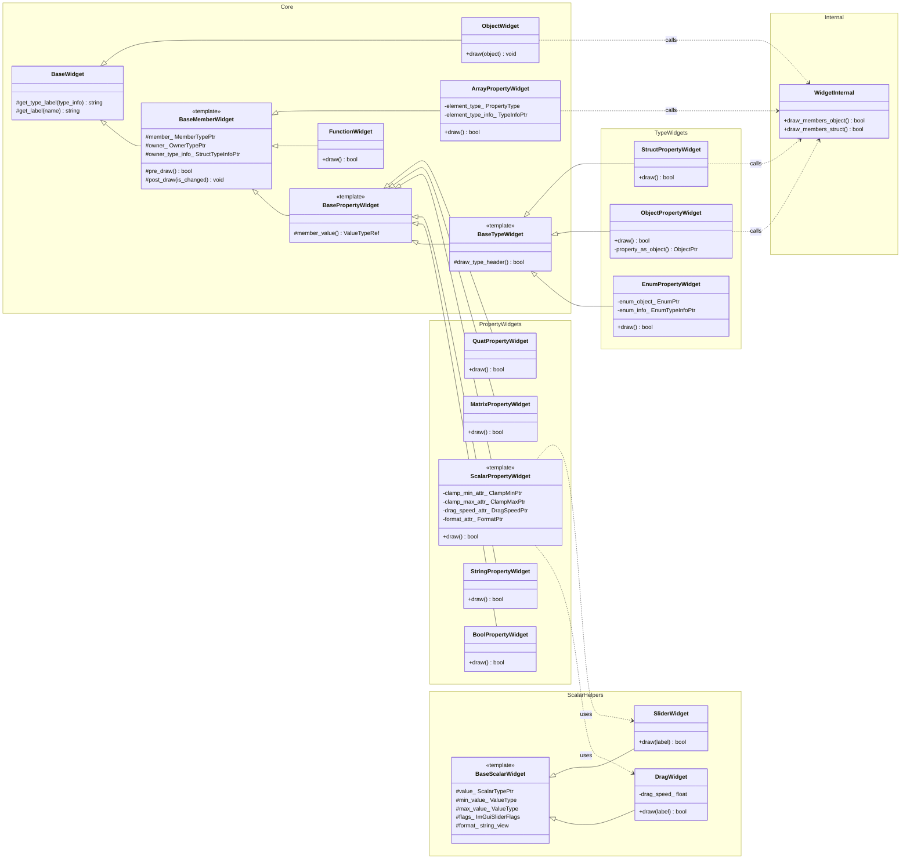

# Widgets Class Diagram

```mermaid
classDiagram
direction LR

namespace Core {
  class BaseWidget {
    #get_type_label(type_info) string
    #get_label(name) string
  }

  class BaseMemberWidget {
    <<template>>
    #member_ MemberTypePtr
    #owner_ OwnerTypePtr
    #owner_type_info_ StructTypeInfoPtr
    #pre_draw() bool
    #post_draw(is_changed) void
  }

  class BasePropertyWidget {
    <<template>>
    #member_value() ValueTypeRef
  }

  class BaseTypeWidget {
    <<template>>
    #draw_type_header() bool
  }

  class ObjectWidget {
    +draw(object) void
  }

  class FunctionWidget {
    +draw() bool
  }

  class ArrayPropertyWidget {
    -element_type_ PropertyType
    -element_type_info_ TypeInfoPtr
    +draw() bool
  }
}

namespace PropertyWidgets {
  class BoolPropertyWidget {
    +draw() bool
  }

  class StringPropertyWidget {
    +draw() bool
  }

  class ScalarPropertyWidget {
    <<template>>
    -clamp_min_attr_ ClampMinPtr
    -clamp_max_attr_ ClampMaxPtr
    -drag_speed_attr_ DragSpeedPtr
    -format_attr_ FormatPtr
    +draw() bool
  }

  class MatrixPropertyWidget {
    +draw() bool
  }

  class QuatPropertyWidget {
    +draw() bool
  }
}

namespace TypeWidgets {
  class EnumPropertyWidget {
    -enum_object_ EnumPtr
    -enum_info_ EnumTypeInfoPtr
    +draw() bool
  }

  class ObjectPropertyWidget {
    +draw() bool
    -property_as_object() ObjectPtr
  }

  class StructPropertyWidget {
    +draw() bool
  }
}

namespace ScalarHelpers {
  class BaseScalarWidget {
    <<template>>
    #value_ ScalarTypePtr
    #min_value_ ValueType
    #max_value_ ValueType
    #flags_ ImGuiSliderFlags
    #format_ string_view
  }

  class DragWidget {
    -drag_speed_ float
    +draw(label) bool
  }

  class SliderWidget {
    +draw(label) bool
  }
}

namespace Internal {
  class WidgetInternal {
    +draw_members_object() bool
    +draw_members_struct() bool
  }
}

BaseWidget <|-- BaseMemberWidget
BaseWidget <|-- ObjectWidget
BaseMemberWidget <|-- BasePropertyWidget
BasePropertyWidget <|-- BaseTypeWidget

BaseMemberWidget <|-- FunctionWidget
BaseMemberWidget <|-- ArrayPropertyWidget

BasePropertyWidget <|-- BoolPropertyWidget
BasePropertyWidget <|-- StringPropertyWidget
BasePropertyWidget <|-- ScalarPropertyWidget
BasePropertyWidget <|-- MatrixPropertyWidget
BasePropertyWidget <|-- QuatPropertyWidget

BaseTypeWidget <|-- EnumPropertyWidget
BaseTypeWidget <|-- ObjectPropertyWidget
BaseTypeWidget <|-- StructPropertyWidget

BaseScalarWidget <|-- DragWidget
BaseScalarWidget <|-- SliderWidget

ObjectWidget ..> WidgetInternal : calls
ArrayPropertyWidget ..> WidgetInternal : calls
ObjectPropertyWidget ..> WidgetInternal : calls
StructPropertyWidget ..> WidgetInternal : calls
ScalarPropertyWidget ..> DragWidget : uses
ScalarPropertyWidget ..> SliderWidget : uses
```

- Core path is BaseWidget -> BaseMemberWidget -> BasePropertyWidget -> BaseTypeWidget.
- FunctionWidget and ArrayPropertyWidget branch directly from BaseMemberWidget.