# PDE / FEM / Fractional Architecture

## Constraints

| Rule | Keep |
|---|---|
| Public notation | `assemble_poisson_P1`, `assemble_fractional_laplacian_P1`, `assemble_and_solve_*_P1`, `PDEPreset::apply`, `PDEPreset::fem_assembler`, `FEMProblem`, `DifferentialEquation` |
| Mathematical split | PDE model ≠ operator definition ≠ discretization ≠ solver |
| Fractional split | `Integral` ≠ `Regional` ≠ `Spectral` |
| Migration | add adapters, do not break callers |

---

## Current shape

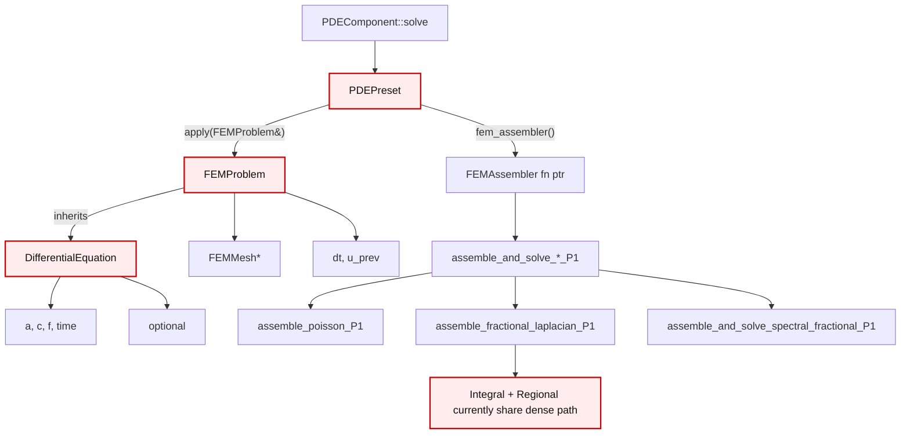

---

## Current coupling map

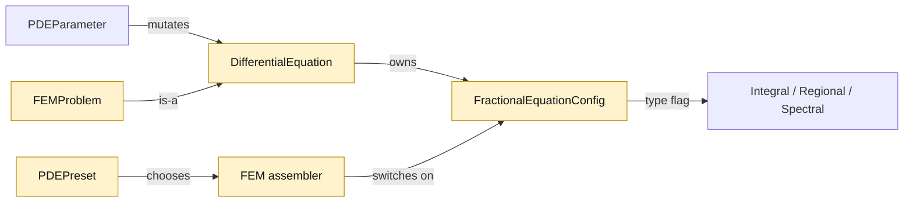

---

## Target layer boundary

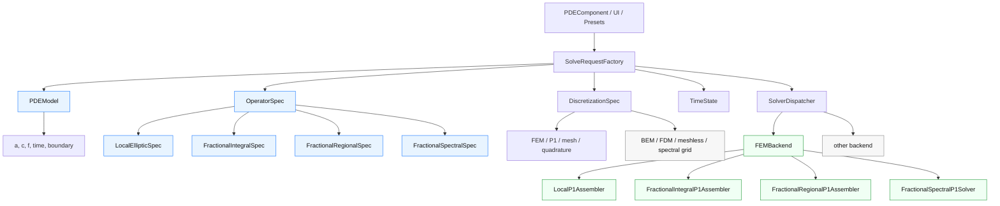

---

## Target types

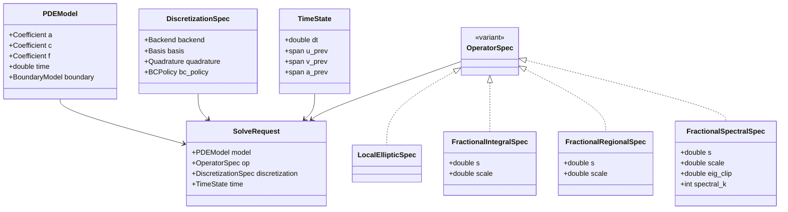

---

## Keep notation by using facades

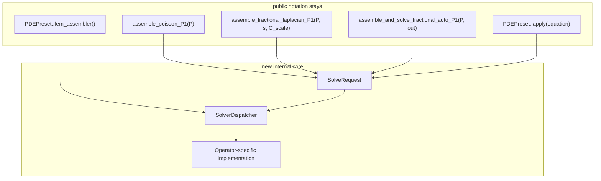

---

## Operator routing

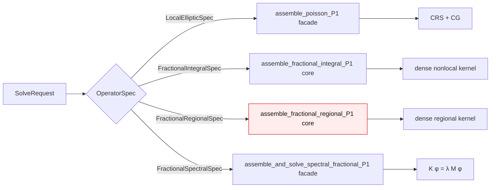

---

## Fractional operator semantics

| `FractionalType` | Mathematical object | Backend path | Boundary meaning | Rule |
|---|---|---|---|---|
| `Integral` | restricted / Riesz-type nonlocal operator | dense kernel | exterior interaction / killed extension | separate core |
| `Regional` | censored operator on `Ω` | dense regional kernel | integration restricted to `Ω` | never silently alias to `Integral` |
| `Spectral` | fractional power of local operator | eigenbasis of local FEM operator | inherited from local BCs | separate solver |

---

## FEM backend decomposition

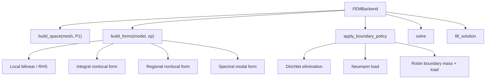

---

## Correct solve sequence

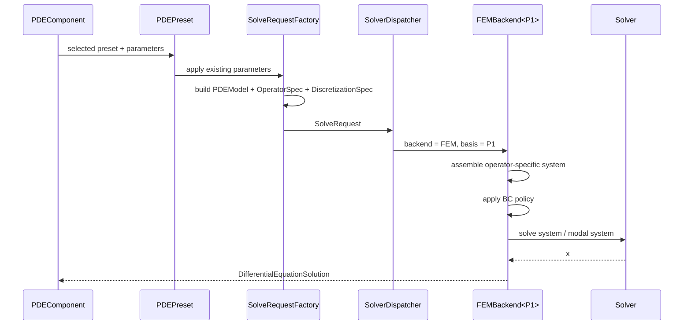

---

## Boundary-condition ownership

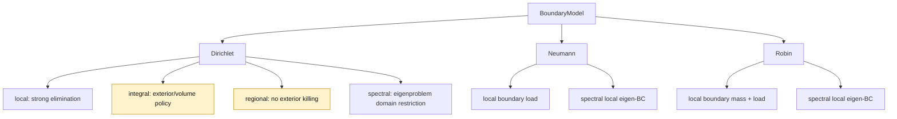

---

## Migration plan

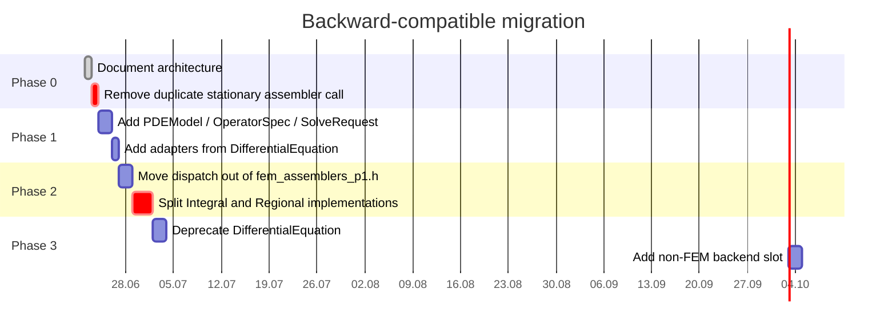

---

## Minimal file layout

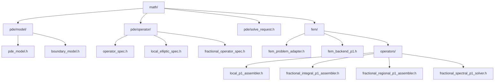

---

## Compatibility map

| Existing symbol | Status | New role |
|---|---|---|
| `DifferentialEquation` | keep | legacy PDE coefficient carrier; adapter source |
| `DifferentialEquation::fractional` | keep temporarily | legacy mirror of `OperatorSpec` |
| `FEMProblem` | keep | FEM bridge/request view |
| `PDEPreset::apply` | keep | fills legacy parameters and/or request factory |
| `PDEPreset::fem_assembler` | keep | facade to dispatcher |
| `assemble_fractional_laplacian_P1` | keep | compatibility wrapper; route only to `Integral` unless explicitly named otherwise |
| `assemble_and_solve_fractional_auto_P1` | keep | dispatches by `OperatorSpec` |
| `FractionalIntegralOperator` | keep as alias | compatibility name for `FractionalElementContribution` |

---

## Immediate corrections

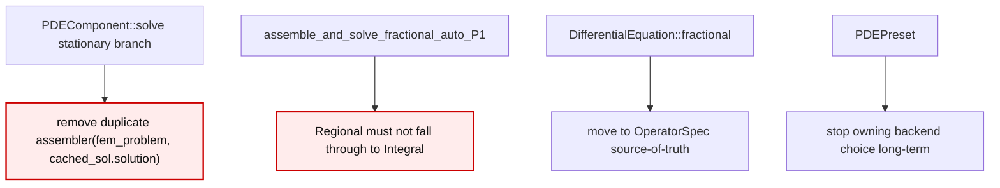

---

## Mathematical invariant checklist

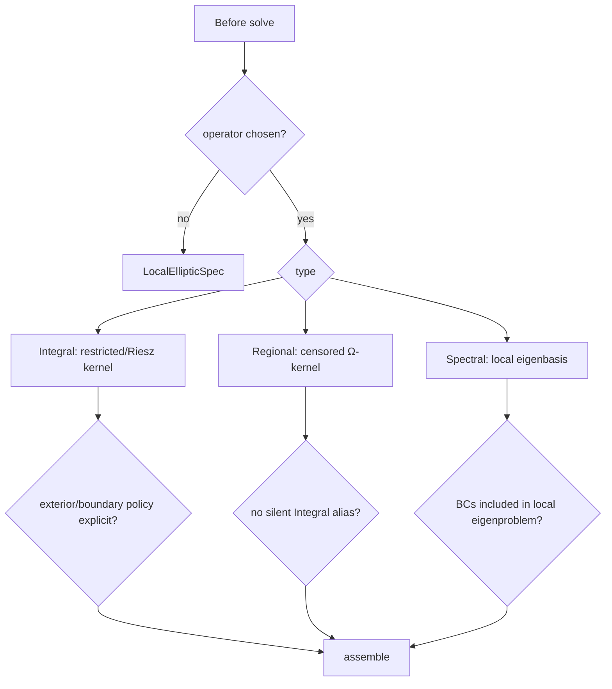

---

## Final target

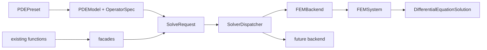
