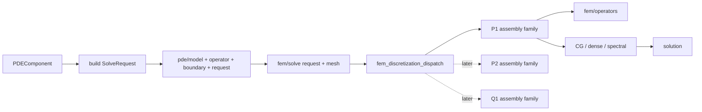
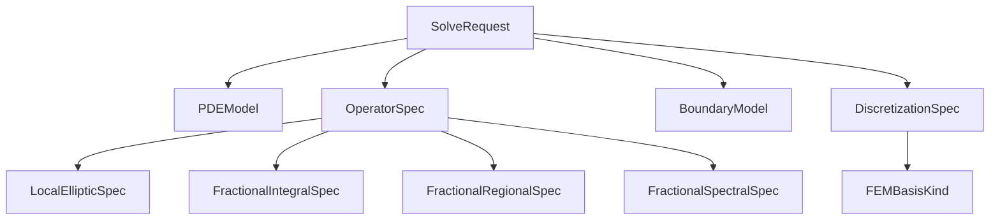
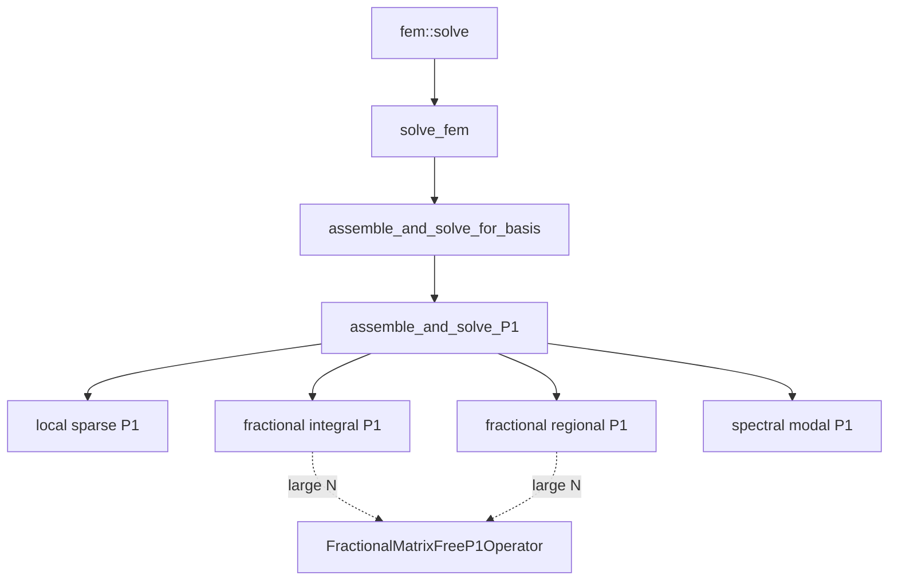
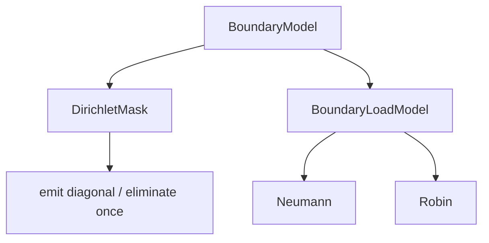
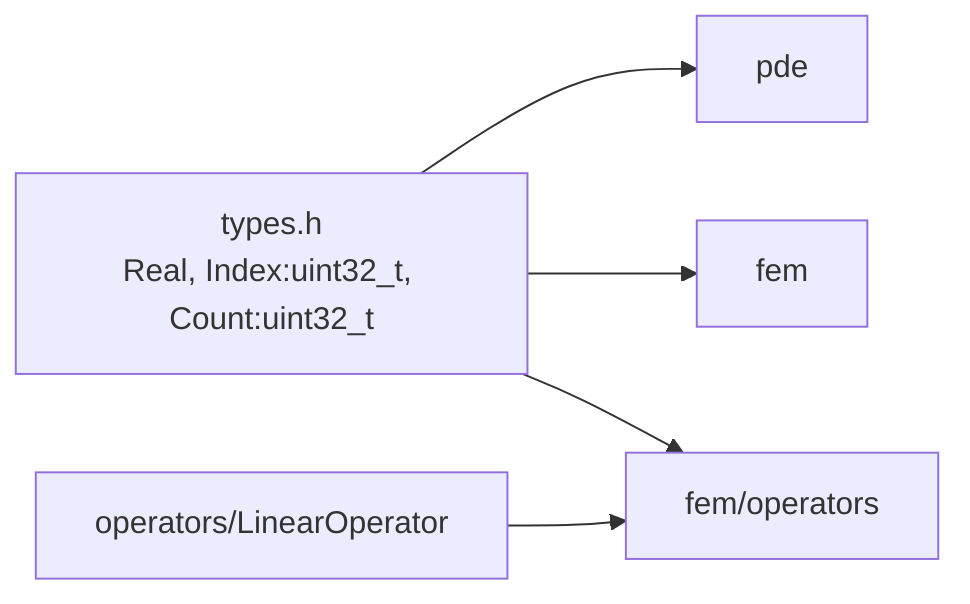

# Math architecture

```mermaid
flowchart LR
    UI[PDEComponent] --> Req[build SolveRequest]
    Req --> PDE[pde/model + operator + boundary + request]
    PDE --> FEM[fem/solve request + mesh]
    FEM --> Basis[fem_discretization_dispatch]
    Basis --> P1[P1 assembly family]
    Basis -. later .-> P2[P2 assembly family]
    Basis -. later .-> Q1[Q1 assembly family]
    P1 --> FEMOps[fem/operators]
    P1 --> Solver[CG / dense / spectral]
    Solver --> Sol[solution]
```

```mermaid
flowchart TD
    SolveRequest --> PDEModel
    SolveRequest --> OperatorSpec
    SolveRequest --> BoundaryModel
    SolveRequest --> DiscretizationSpec
    DiscretizationSpec --> Basis[FEMBasisKind]
    OperatorSpec --> LocalEllipticSpec
    OperatorSpec --> FractionalIntegralSpec
    OperatorSpec --> FractionalRegionalSpec
    OperatorSpec --> FractionalSpectralSpec
```

```mermaid
flowchart TD
    femsolve[fem::solve] --> fembackend[solve_fem]
    fembackend --> basis[assemble_and_solve_for_basis]
    basis --> p1[assemble_and_solve_P1]
    p1 --> Local[local sparse P1]
    p1 --> Integral[fractional integral P1]
    p1 --> Regional[fractional regional P1]
    p1 --> Spectral[spectral modal P1]
    Integral -. large N .-> MatrixFree[FractionalMatrixFreeP1Operator]
    Regional -. large N .-> MatrixFree
```

```mermaid
flowchart TD
    BoundaryModel --> Mask[DirichletMask]
    Mask --> Assembly[emit diagonal / eliminate once]
    BoundaryModel --> Natural[BoundaryLoadModel]
    Natural --> Neumann
    Natural --> Robin
```

```mermaid
flowchart LR
    types[types.h\nReal, Index:uint32_t, Count:uint32_t] --> pde
    types --> fem
    types --> femops[fem/operators]
    linop[operators/LinearOperator] --> femops
```
