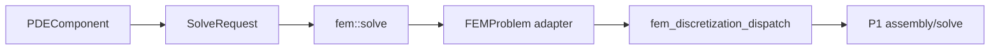
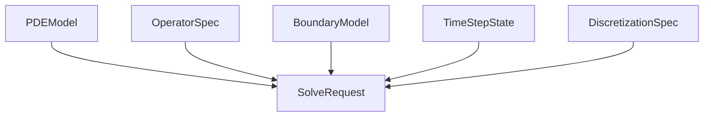
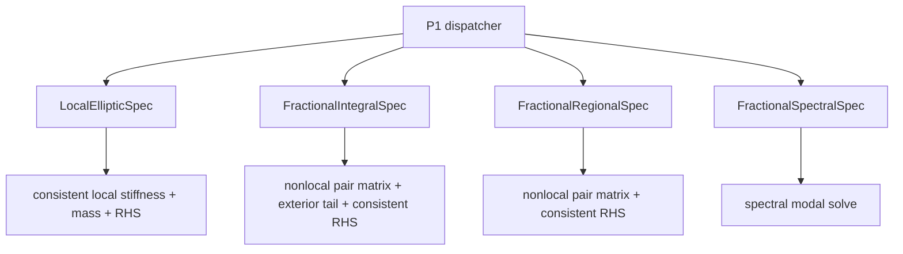
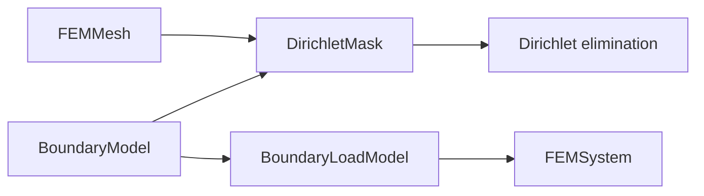
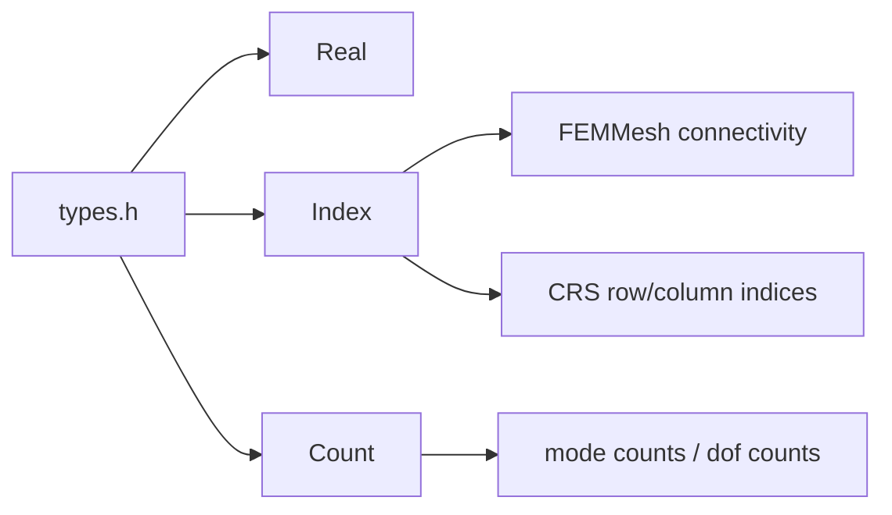
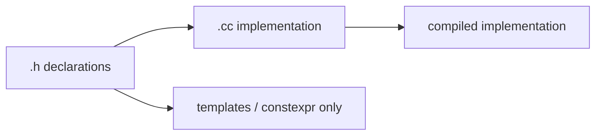

# math architecture

## Header / source split

Policy: non-template FEM/PDE implementation lives in `.cc`; headers keep type declarations, function declarations, lightweight templates, constexpr constants, and engine registration declarations.
