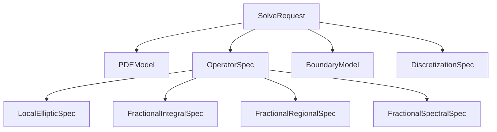
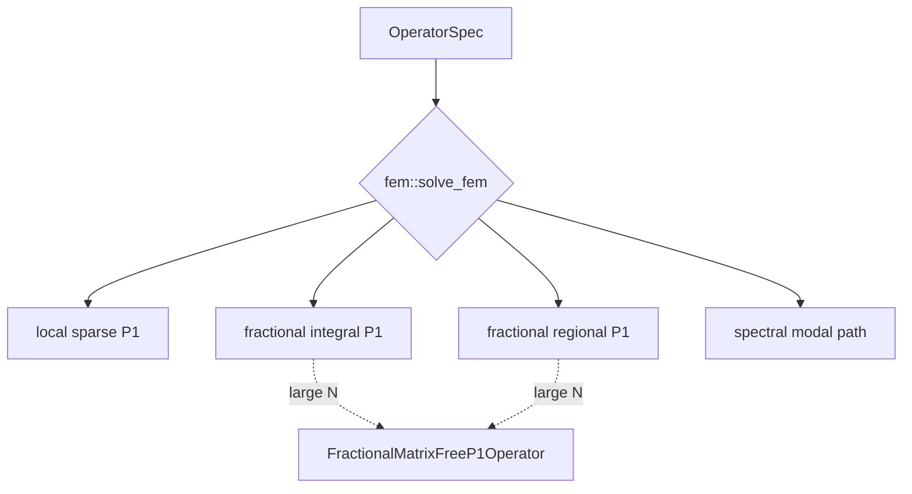
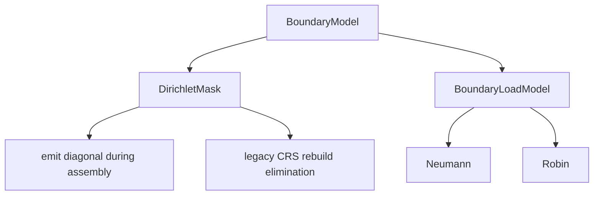
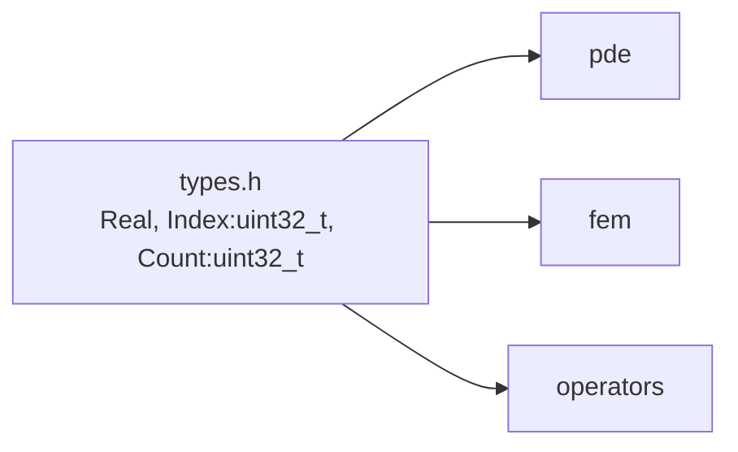

# Math architecture

```mermaid
flowchart LR
    UI[PDEComponent] --> Req[build SolveRequest]
    Req --> PDE[pde/
model + operator + boundary + request]
    PDE --> FEM[fem/
solve(request, mesh)]
    FEM --> Assembly[P1 assembly]
    Assembly --> Ops[operators/
reusable kernels]
    Assembly --> Solver[CG / dense / spectral]
    Solver --> Sol[solution]
```








